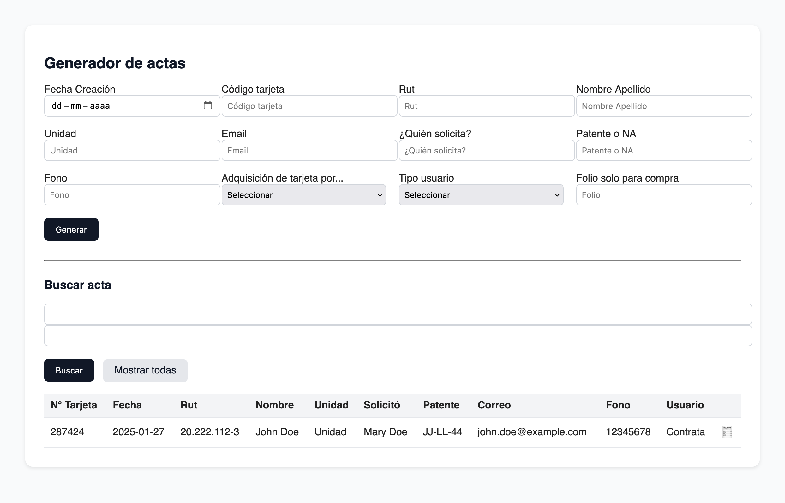

# Generador de Actas

Una aplicación web para la gestión y generación de actas en formato PDF. Este sistema permite registrar datos de usuarios y generar documentos PDF formateados con la información correspondiente.

## 🚀 Características

- **Registro de actas**: Formulario web para ingresar datos de funcionarios y sus tarjetas de acceso
- **Generación de PDF**: Creación automática de actas en formato PDF con diseño profesional
- **Búsqueda y filtrado**: Sistema de búsqueda para encontrar actas por código de tarjeta o nombre
- **Base de datos**: Almacenamiento persistente de todos los registros
- **Interfaz responsive**: Diseño adaptable a diferentes dispositivos

## Previsualización



## 📋 Requisitos

- PHP 7.0 o superior
- MySQL/MariaDB
- Servidor web (Apache, Nginx, etc.)
- Extensión FPDF para generación de PDF (instalada por defecto)

## 🛠️ Instalación

1. **Clonar el repositorio**:
   ```bash
   git clone https://github.com/tu-usuario/actas-generator.git
   cd actas-generator
   ```

2. **Configurar la base de datos**:
   ```bash
   mysql -u root -p < actas_db.sql
   ```

3. **Configurar conexión**:
   - Editar los archivos PHP y modificar las credenciales de la base de datos:
   ```php
   $conexion = new mysqli("localhost", "usuario", "contraseña", "actas_db");
   ```

4. **Permisos**:
   ```bash
   chmod 755 *.php
   chmod -R 755 images/
   chmod -R 755 fpdf/
   ```

5. **Acceder a la aplicación**:
   - Abrir en el navegador: `http://localhost/actas-generator`

## 📁 Estructura del Proyecto

```
actas-generator/
├── index.php              # Página principal con formulario y listado
├── guardar_acta.php       # Procesamiento y guardado de datos
├── generar_pdf.php        # Generación de PDFs
├── buscar_acta.php        # Búsqueda de actas
├── actas_db.sql          # Estructura de la base de datos
├── style.css             # Estilos de la aplicación
├── favicon.ico           # Icono de la aplicación
├── images/               # Imágenes del sistema
└── fpdf/                 # Librería para generación de PDFs
```

## 🔧 Uso

### Crear un nueva acta:
1. Completar el formulario con los datos del funcionario
2. Hacer clic en "Generar"
3. El sistema guardará los datos y mostrará confirmación

### Generar PDF:
1. Buscar el acta deseada en la tabla
2. Hacer clic en el icono 🧾
3. Se abrirá el PDF en una nueva pestaña

### Buscar actas:
1. Usar el formulario de búsqueda
2. Ingresar código de tarjeta o nombre
3. Presionar "Buscar"

## 📄 Licencia

Este proyecto está licenciado bajo **Creative Commons Attribution-NonCommercial 4.0 International (CC BY-NC 4.0)**.

### Propósito del Proyecto

Esta aplicación está diseñada exclusivamente para:
- **Fines educativos** y aprendizaje de desarrollo web
- **Pruebas y experimentación** con tecnologías PHP y MySQL
- **Desarrollo de habilidades** en gestión de formularios y generación de PDFs

### Permisos:
- ✅ Uso educativo y académico
- ✅ Estudio del código fuente
- ✅ Modificación para aprendizaje
- ✅ Experimentación no comercial

### Restricciones:
- ❌ Uso comercial está estrictamente prohibido
- ❌ No se permite vender o monetizar este software
- ❌ Prohibida la implementación en sistemas de producción
- ❌ No se puede usar en entornos empresariales sin autorización

**Ver el texto completo de la licencia en el archivo [LICENSE.md](LICENSE.md)**

## 🤝 Contribuciones

Las contribuciones son bienvenidas para fines educativos. Por favor:
- Mantener el propósito educativo del proyecto
- Documentar adecuadamente los cambios propuestos
- Respetar los términos de la licencia CC BY-NC 4.0

---

**Nota importante:** Este software está diseñado específicamente para fines educativos y de aprendizaje. No está destinado para uso comercial o implementación en entornos productivos.
